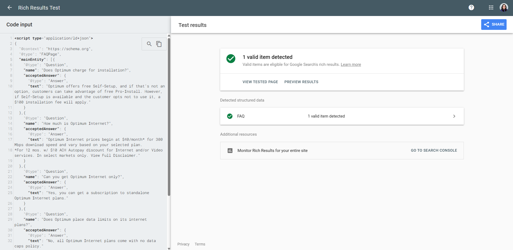
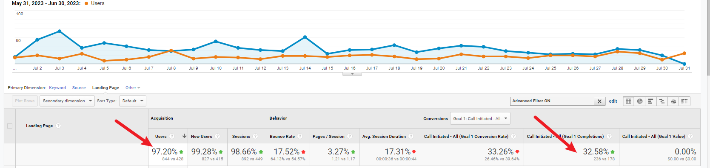

# 📈 SEO Data Audit — Optimum Internet Services Affiliate Landing Page

**Real-world technical SEO audit with GA4 results, FAQ Schema markup, validation screenshots, and a published blog — for an affiliate landing page promoting _Optimum Internet Services_.**

---

## 🚀 Overview

This repository showcases a complete SEO improvement case study for an affiliate landing page promoting **Optimum Internet Services**.  
It includes:

- **GA4 performance results**  
- **Validated FAQ Schema Markup**  
- **Technical SEO enhancements**  
- **UX improvement suggestions**  
- Screenshots, schema code snippets, and a published blog  

---

## ✅ Schema Validation

The structured data was tested using Google’s [Rich Results Test](https://search.google.com/test/rich-results/result).



---

## 📝 Published Blog

Read the full case study blog here:  
[How I Increased Organic Calls for Optimum Internet Services](blogs/published-blog.md)

**HTML Code:** [View HTML Version](blogs/published-blog.html)

---

## 📊 GA4 Performance Highlights

After implementing technical SEO strategies, the landing page achieved:

- ✅ **+97.20% increase in users**  
- ✅ **+99.28% increase in new users**  
- ✅ **+98.66% increase in sessions**  
- ✅ **+32.58% increase in calls initiated**  



---

## 📢 Disclaimer

This SEO audit is an independent case study shared for educational and portfolio purposes only.  
It is not affiliated with or endorsed by **Optimum** or **Altice USA**.  
All brand names, logos, and trademarks belong to their respective owners.

---

## 📁 Project Structure

```plaintext
/
├── screenshots/
│   ├── ga4-metrics-optimum.png
│   ├── rich-results-test-optimum-faq.png
├── blogs/
│   ├── published-blog.md
│   ├── published-blog.html
├── schema/
│   ├── faq-schema.json
├── README.md
